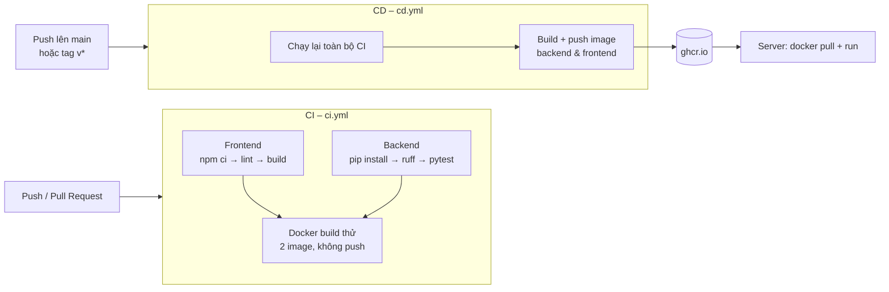

# CI/CD của ZooGuide hoạt động như thế nào

Tài liệu này giải thích hai file trong `.github/workflows/`: chúng chạy khi nào, làm những gì, xem kết quả ở đâu và xử lý thế nào khi bị lỗi.

## 1. CI/CD là gì (trong dự án này)

- **CI – Continuous Integration (tích hợp liên tục)**: mỗi lần đẩy code lên GitHub, một máy ảo của GitHub tự tải code về, cài thư viện, **kiểm tra lint, chạy test và build**. Nếu có bước nào lỗi, bạn biết ngay commit nào gây lỗi, trước khi code vào nhánh chính.
- **CD – Continuous Delivery (phân phối liên tục)**: khi code vào nhánh `main` (hoặc khi gắn tag phiên bản), sau khi CI đạt, GitHub tự **đóng gói backend và frontend thành 2 Docker image** và đẩy lên kho image của GitHub (GHCR). Server chỉ cần tải image về là chạy được.

> CD ở đây dừng lại ở bước **tạo sẵn image để triển khai**. Chưa có bước tự động đăng nhập vào server để cài lại ứng dụng (xem mục 9).

Mọi thứ chạy bằng **GitHub Actions**, miễn phí với repository công khai và có hạn mức phút chạy miễn phí mỗi tháng với repository riêng tư.

## 2. Sơ đồ tổng quan



Nếu trình xem Markdown không vẽ được sơ đồ, có thể hình dung như sau:

```
Push/PR ─► CI: [Frontend] ┐
               [Backend ] ┴─► [Docker build thử]

Push main / tag v* ─► CD: [Toàn bộ CI] ─► [Push image lên ghcr.io] ─► Server tải về chạy
```

## 3. Khi nào workflow chạy

| Sự kiện của bạn | `ci.yml` | `cd.yml` | Kết quả |
|---|---|---|---|
| Push lên nhánh `develop` | ✅ | – | Chỉ kiểm tra |
| Push lên nhánh khác (vd `feature/map`) | – | – | Không chạy gì cho tới khi mở Pull Request |
| Mở hoặc cập nhật Pull Request | ✅ | – | Kết quả hiện ngay trong trang PR |
| Push / merge vào `main` | ✅ | ✅ | Kiểm tra, rồi đẩy image tag `main`, `latest`, `sha-…` |
| Push tag `v1.2.0` | (được CD gọi) | ✅ | Đẩy image tag `1.2.0`, `sha-…` |
| Bấm **Run workflow** trong tab Actions | ✅ | ✅ | Chạy tay khi cần |

Nếu bạn push liên tiếp nhiều lần lên cùng một nhánh, lần chạy CI cũ chưa xong sẽ **tự bị hủy** để tiết kiệm thời gian (khối `concurrency` trong `ci.yml`).

## 4. CI – `ci.yml` làm gì

CI gồm 3 **job**. Mỗi job chạy trên một máy Ubuntu mới tinh, nên phải tự tải code và cài lại mọi thứ.

### Job 1 – `Frontend (lint + build)`

| Bước | Lệnh | Mục đích | Lỗi khi nào |
|---|---|---|---|
| Checkout | `actions/checkout` | Tải code của commit vừa push | – |
| Cài Node 20 | `actions/setup-node` (`cache: npm`) | Cài Node, lưu cache thư viện để lần sau nhanh hơn | – |
| Cài thư viện | `npm ci` | Cài **đúng** phiên bản ghi trong `package-lock.json` | `package.json` và `package-lock.json` lệch nhau (sửa `package.json` bằng tay mà quên chạy `npm install`) |
| Lint | `npm run lint` | ESLint tìm lỗi code: biến không dùng, sai quy tắc React Hooks… | Có lỗi ESLint |
| Build | `npm run build` | Vite đóng gói ứng dụng vào `dist/` | Import sai đường dẫn, lỗi cú pháp JSX… |
| Lưu artifact | `actions/upload-artifact` | Lưu thư mục `dist/` 7 ngày để tải về xem | – |

`VITE_API_BASE_URL` được truyền vào lúc build vì Vite **ghi cứng** địa chỉ backend vào file JS. Giá trị lấy từ biến repository `VITE_API_BASE_URL` (nếu có), nếu không thì dùng `http://localhost:8000`.

### Job 2 – `Backend (ruff + pytest)`

Chạy trong thư mục `backend/`, **song song** với job Frontend.

| Bước | Lệnh | Mục đích |
|---|---|---|
| Cài Python 3.12 | `actions/setup-python` (`cache: pip`) | Cài Python và cache thư viện |
| Cài thư viện | `pip install -r requirements-dev.txt` | FastAPI, uvicorn, PyJWT + pytest, httpx, ruff |
| Lint | `ruff check .` | Kiểm tra lỗi, thứ tự import, dòng quá dài (> 120 ký tự), cú pháp cũ… (cấu hình trong `backend/pyproject.toml`) |
| Test | `pytest -q` | Chạy `backend/tests/test_api.py`: gọi thật từng endpoint (đăng nhập, phân quyền, CRUD, đánh giá, chatbot, CORS…) |

Test dùng **file dữ liệu tạm** (xem `backend/tests/conftest.py`) và reset lại dữ liệu mẫu trước mỗi test, nên kết quả luôn giống nhau và không đụng tới `backend/data/db.json`.

### Job 3 – `Docker build (kiểm tra)`

- Chỉ chạy khi **cả 2 job trên đều đạt** (`needs: [frontend, backend]`).
- Build thử `backend/Dockerfile` và `Dockerfile` ở thư mục gốc (frontend), **không đẩy** lên đâu cả.
- Mục đích: phát hiện sớm Dockerfile bị hỏng (thiếu file, sai lệnh) ngay trong Pull Request, thay vì đợi tới lúc CD mới biết.
- `cache-from/cache-to: type=gha`: lưu các lớp (layer) Docker vào cache của GitHub, nên lần build sau chỉ làm lại phần thay đổi.

## 5. CD – `cd.yml` làm gì

### Bước 1 – `test`: chạy lại CI

```yaml
test:
  uses: ./.github/workflows/ci.yml
```

CD **gọi lại chính `ci.yml`** (nhờ dòng `workflow_call` trong `ci.yml`). Như vậy image **chỉ được đẩy lên khi toàn bộ lint, test và Docker build đều đạt**. Code lỗi không bao giờ thành image.

### Bước 2 – `publish`: build và đẩy image

Dùng `strategy.matrix` để chạy **2 bản song song** với cùng các bước:

| matrix.image | Thư mục build | Dockerfile | Image tạo ra |
|---|---|---|---|
| `backend` | `backend/` | `backend/Dockerfile` (Python 3.12 + uvicorn) | `ghcr.io/<owner>/<repo>-backend` |
| `frontend` | `.` | `Dockerfile` (build Vite → phục vụ bằng nginx) | `ghcr.io/<owner>/<repo>-frontend` |

Các bước:

1. **Đăng nhập GHCR** bằng `secrets.GITHUB_TOKEN`. Token này do GitHub tự cấp cho mỗi lần chạy, bạn **không cần tạo secret nào**. Khối `permissions: packages: write` cho phép token được đẩy image.
2. **Tính tên tag** bằng `docker/metadata-action` (xem mục 6).
3. **Build và push** bằng `docker/build-push-action`, truyền `VITE_API_BASE_URL` vào image frontend.

## 6. Các tag của image

| Tình huống | Tag được tạo | Dùng để |
|---|---|---|
| Push lên `main`, commit `a1b2c3d` | `main`, `latest`, `sha-a1b2c3d` | `latest` = bản mới nhất; `sha-…` = đúng một commit |
| Push tag `v1.2.0` | `1.2.0`, `sha-…` | Bản phát hành cố định |

Nên dùng `1.2.0` hoặc `sha-…` trên server thật: nếu bản mới lỗi, chỉ cần chạy lại tag cũ để quay về (rollback).

Tạo bản phát hành:

```bash
git tag v1.0.0
git push origin v1.0.0
```

## 7. Cài đặt lần đầu trên GitHub

1. **Đưa code lên GitHub** (thư mục hiện chưa phải git repository):
   ```bash
   git init
   git add .
   git commit -m "Initial commit"
   git branch -M main
   git remote add origin https://github.com/<owner>/<repo>.git
   git push -u origin main
   ```
2. **Settings → Actions → General → Workflow permissions** → chọn **Read and write permissions** → Save. Thiếu bước này thì job `publish` bị lỗi `denied: permission_denied`.
3. (Tuỳ chọn) **Settings → Secrets and variables → Actions → tab Variables → New repository variable**:
   - Tên: `VITE_API_BASE_URL`
   - Giá trị: địa chỉ backend thật, vd `https://api.zooguide.example.com`
4. Sau lần chạy CD đầu tiên, image nằm ở trang repository → mục **Packages** (cột bên phải). Mặc định image là **private**. Muốn server tải về không cần đăng nhập thì vào package → **Package settings → Change visibility → Public**.

## 8. Quy trình làm việc hằng ngày

```
1. git checkout -b feature/ten-tinh-nang      # tạo nhánh mới
2. Sửa code, chạy thử local:  npm run dev
3. Tự kiểm tra trước khi push (giống hệt CI):
      npm run lint && npm run build
      cd backend && ruff check . && pytest -q
4. git push -u origin feature/ten-tinh-nang
5. Mở Pull Request vào main  →  CI chạy, kết quả hiện ở cuối trang PR
6. CI xanh ✅ → Merge  →  CD tự đẩy image mới lên ghcr.io
7. Khi muốn chốt phiên bản: git tag v1.x.y && git push origin v1.x.y
```

Nên bật **Settings → Branches → Add branch protection rule** cho `main`, tick *Require status checks to pass before merging* và chọn 3 job của CI. Khi đó GitHub **không cho merge** Pull Request nào có CI đỏ.

## 9. Xem kết quả và xử lý khi lỗi

Vào tab **Actions** của repository → chọn lần chạy → chọn job bị đỏ ❌ → mở bước bị lỗi để đọc log.

| Job / bước lỗi | Nguyên nhân thường gặp | Cách sửa (chạy thử ở máy trước) |
|---|---|---|
| Frontend → `npm ci` | `package-lock.json` không khớp `package.json` | `npm install` rồi commit cả `package-lock.json` |
| Frontend → `npm run lint` | Biến không dùng, vi phạm quy tắc hooks | `npm run lint`, sửa theo số dòng được báo |
| Frontend → `npm run build` | Import sai đường dẫn, **sai chữ hoa/thường** trong tên file (Windows không phân biệt, Linux thì có) | `npm run build`; kiểm tra lại tên file trong lệnh import |
| Backend → `ruff check` | Import thừa, dòng quá 120 ký tự | `cd backend && ruff check --fix .` |
| Backend → `pytest` | Sửa API làm hỏng hành vi đã có test | `cd backend && pytest -q`; sửa code hoặc cập nhật test nếu thay đổi là cố ý |
| Docker build | Dockerfile tham chiếu file đã xóa/đổi tên | Xem log bước `COPY`/`RUN` bị lỗi |
| CD → publish: `denied` / `permission_denied` | Chưa bật *Read and write permissions* | Làm lại bước 2 mục 7 |

Sau khi sửa, chỉ cần commit và push. CI tự chạy lại. Muốn chạy lại mà không sửa gì: nút **Re-run jobs** trong trang lần chạy.

## 10. Triển khai image lên server

Trên server đã cài Docker:

```bash
# Nếu image để private: đăng nhập bằng Personal Access Token có quyền read:packages
echo <TOKEN> | docker login ghcr.io -u <github-username> --password-stdin

docker pull ghcr.io/<owner>/<repo>-backend:latest
docker pull ghcr.io/<owner>/<repo>-frontend:latest

docker run -d --name zoo-backend -p 8000:8000 \
  -e ZOOGUIDE_SECRET_KEY='<chuoi-bi-mat-dai-ngau-nhien>' \
  -e ZOOGUIDE_CORS_ORIGINS='https://zooguide.example.com' \
  -e ZOOGUIDE_CORS_ORIGIN_REGEX='' \
  -v zoo-data:/data \
  ghcr.io/<owner>/<repo>-backend:latest

docker run -d --name zoo-frontend -p 80:80 ghcr.io/<owner>/<repo>-frontend:latest
```

- `-v zoo-data:/data`: giữ file dữ liệu `db.json` khi cập nhật hoặc xóa container.
- `ZOOGUIDE_CORS_ORIGIN_REGEX=''`: tắt chế độ "cho mọi cổng localhost", chỉ nhận đúng địa chỉ frontend thật.
- Image frontend đã nhúng sẵn `VITE_API_BASE_URL` lúc build. Đổi địa chỉ backend thì phải **build lại image** (sửa biến repository rồi chạy lại CD), không đổi được bằng `-e` khi `docker run`.

Cập nhật lên bản mới: `docker pull …` → `docker rm -f zoo-backend zoo-frontend` → chạy lại 2 lệnh `docker run` như trên.

## 11. Giới hạn hiện tại và hướng mở rộng

- **Push lên `main` thì CI chạy 2 lần**: một lần do chính `ci.yml`, một lần do CD gọi lại. Việc này có chủ đích để CD luôn tự kiểm tra trước khi đẩy image, chỉ tốn thêm vài phút. Muốn bỏ thì xóa `main` khỏi `on.push.branches` trong `ci.yml`.
- **Chưa tự động cài lên server**: có thể thêm một job `deploy` sau `publish`, dùng `appleboy/ssh-action` để SSH vào server rồi chạy `docker pull` + `docker run`. Thông tin server (host, user, private key) lưu trong **Secrets**.
- **Lưu dữ liệu bằng file JSON** chỉ phù hợp khi chạy **1 container backend**. Muốn chạy nhiều bản song song thì chuyển sang cơ sở dữ liệu (PostgreSQL…).
- **Chưa có test giao diện** (vd Playwright). Có thể thêm một job khởi động `docker compose up` rồi chạy test trình duyệt.

## 12. File liên quan

| File | Vai trò |
|---|---|
| `.github/workflows/ci.yml` | Kiểm tra: lint, test, build, build thử Docker |
| `.github/workflows/cd.yml` | Gọi CI rồi đẩy image lên GHCR |
| `backend/Dockerfile`, `backend/.dockerignore` | Image backend (Python 3.12, chạy bằng user thường, có healthcheck `/api/health`) |
| `Dockerfile`, `nginx.conf`, `.dockerignore` | Image frontend: build bằng Node, phục vụ bằng nginx, chuyển mọi đường dẫn về `index.html` cho React Router |
| `docker-compose.yml` | Chạy cả 2 image ở máy local: `docker compose up --build` |
| `eslint.config.js` | Luật lint frontend |
| `backend/pyproject.toml` | Cấu hình pytest và ruff |
| `backend/requirements.txt` / `requirements-dev.txt` | Thư viện chạy / thư viện thêm cho test và lint |
